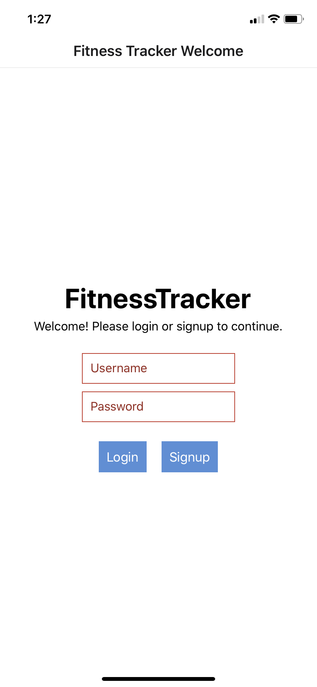
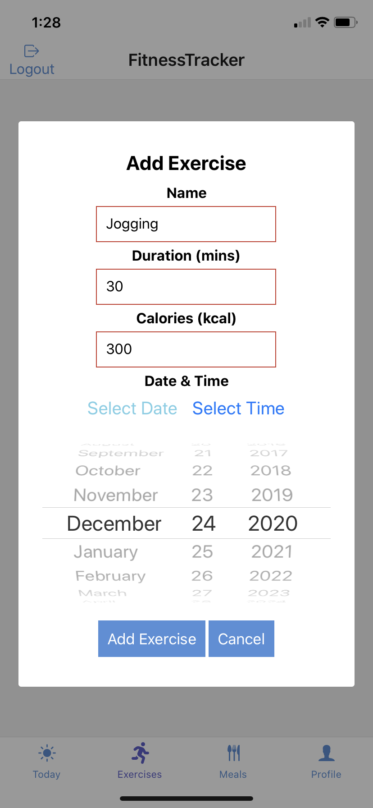
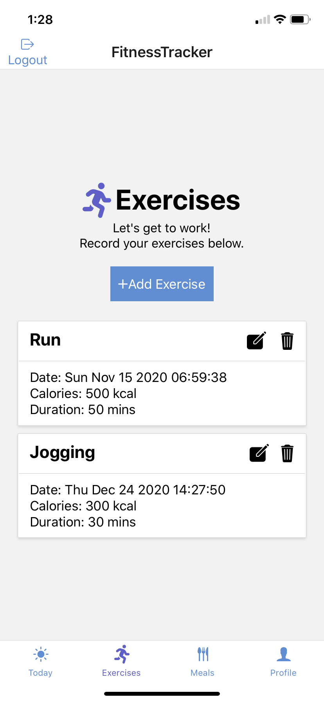
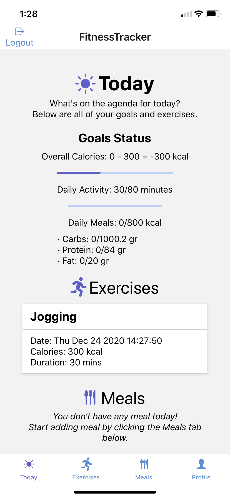
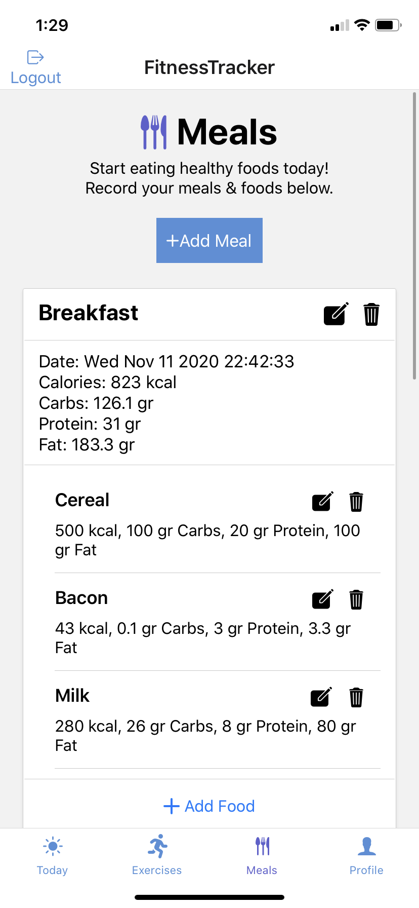
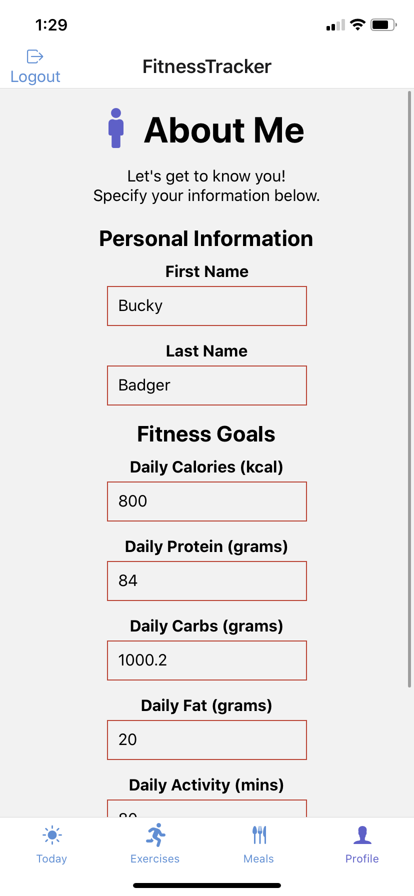

# Fitness Tracker Application in React Native (iOS only)
This the frontend application in React Native that can track your fitness exercises and calories based on meals. The backend endpoints are available in the [collection (v2.1) of the Postman requests](/ReactNative.postman_collection.json).

### Screenshots
 |  |  |  |  | 

### Features
- Sign-up & Log-in
- Today's Goals & Reminders
- Exercises & Meals Tracker
- Profile View
- Accessibility Features (VoiceOver)

### Installation
Make sure you have [npm](https://docs.npmjs.com/) and [expo CLI](https://docs.expo.io/workflow/expo-cli/) installed. To install all the dependencies for the first time, run `expo install`. Once installed, simply run `expo start` to start the project.
